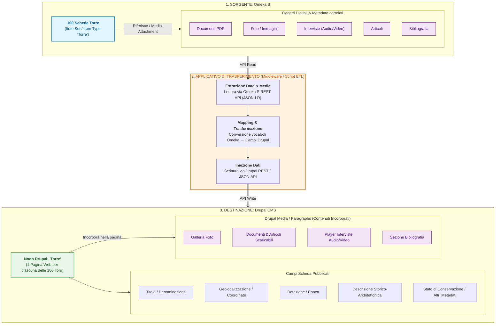

```mermaid
flowchart TD
    classDef omekaStyle fill:#e1f5fe,stroke:#0288d1,stroke-width:2px,color:#01579b;
    classDef appStyle fill:#fff3e0,stroke:#f57c00,stroke-width:2px,color:#e65100;
    classDef drupalStyle fill:#e8f5e9,stroke:#388e3c,stroke-width:2px,color:#1b5e20;
    classDef mediaStyle fill:#f3e5f5,stroke:#7b1fa2,stroke-width:1px,color:#4a148c;

    subgraph OMEKA ["1. SORGENTE: Omeka S"]
        O_Cards["<b>100 Schede Torre</b><br/>(Item Set / Item Type 'Torre')"]:::omekaStyle
        
        subgraph O_Assets ["Oggetti Digitali & Metadata correlati"]
            O_Doc["Documenti PDF"]:::mediaStyle
            O_Foto["Foto / Immagini"]:::mediaStyle
            O_Audio["Interviste (Audio/Video)"]:::mediaStyle
            O_Art["Articoli"]:::mediaStyle
            O_Bib["Bibliografia"]:::mediaStyle
        end
        
        O_Cards -->|Riferisce / Media Attachment| O_Assets
    end

    subgraph APP ["2. APPLICATIVO DI TRASFERIMENTO (Middleware / Script ETL)"]
        A_Extract["<b>Estrazione Data & Media</b><br/>Lettura via Omeka S REST API (JSON-LD)"]
        A_Map["<b>Mapping & Trasformazione</b><br/>Conversione vocaboli Omeka → Campi Drupal"]
        A_Load["<b>Iniezione Dati</b><br/>Scrittura via Drupal REST / JSON:API"]
        
        A_Extract --> A_Map --> A_Load
    end
    
    class APP appStyle;

    subgraph DRUPAL ["3. DESTINAZIONE: Drupal CMS"]
        D_Node["<b>Nodo Drupal: 'Torre'</b><br/>(1 Pagina Web per ciascuna delle 100 Torri)"]:::drupalStyle
        
        subgraph D_Fields ["Campi Scheda Pubblicati"]
            D_F1["Titolo / Denominazione"]
            D_F2["Geolocalizzazione / Coordinate"]
            D_F3["Datazione / Epoca"]
            D_F4["Descrizione Storico-Architettonica"]
            D_F5["Stato di Conservazione / Altri Metadati"]
        end

        subgraph D_Media [" Drupal Media / Paragraphs (Contenuti Incorporati)"]
            D_M1["Galleria Foto"]:::mediaStyle
            D_M2["Documenti & Articoli Scaricabili"]:::mediaStyle
            D_M3["Player Interviste Audio/Video"]:::mediaStyle
            D_M4["Sezione Bibliografia"]:::mediaStyle
        end

        D_Node --> D_Fields
        D_Node -->|Incorpora nella pagina| D_Media
    end

    OMEKA ==>|API Read| A_Extract
    A_Load ==>|API Write| DRUPAL
```
